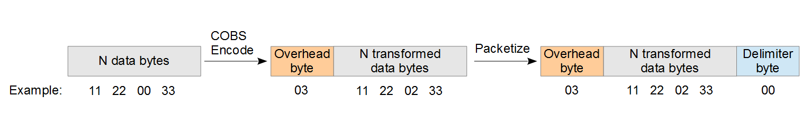

## Pack Protocol info

The magic trick behind the library are the protocol used to encode/decode and send the packs use this elements:

- [COBS codification](https://en.wikipedia.org/wiki/Consistent_Overhead_Byte_Stuffing) to transform any data-pack in **self ended pack data**, different data-pack haven't the necessity to have the same size.
- [CRC8](https://en.wikipedia.org/wiki/Cyclic_redundancy_check) to and minimal security check of the pack transmission (This feature can be disable, but here are suppose always active).

This elements permit to the library the Send/Receive operation not only for 1 type of message, but **any number of different pack** all in the same stream and with the same library.

## Algorithm Flow
#### Send Procedure

1. Fill the pack to be send, if there are more type of pack, specify the type in an opportune manner (see **[MSG standardize](### MSG standardize)**) (Is **your Responsibility**)

Library now start:

2. The sending stream is used to calculate his CRC8
3. The CRC8 calculated are append at the and of the stream
4. The new data-stream are COBS-Encoded
5. The result byte-string are send to the outputting device with  `\0`  byte at the end

#### Receive Procedure
Now the receive device read this stream, and on the first `\0` receive the library start parsing procedure:
6. The byte stream between this new  `\0`  and the last-one are COBS-decoded
7. The CRC8 of the first `n-1`byte are calculate and compared with the CRC8 send
   - [Compare Success] Pack are store and wait to be read
   - [Compare Fail] Pack is discard and unambiguous pack problem is solve for sure, the only solution is wait new pack incoming.


## COBS-Encoding



For more info [see on Wikipedia](https://en.wikipedia.org/wiki/Consistent_Overhead_Byte_Stuffing)


---

### MSG standardize

The system not need any specific format for the message, are simply a `C struct` with the `__attribute__((packed))` to reduce the size.

With this simply rules is possible define 2 different and asymmetric pack:

```c
#include <stdint.h>	// To be sure for the footPrint in any platform
struct _packLinux2Ard {
  int16_t num;
  char buf[20];
} __attribute__((packed));
typedef struct _packLinux2Ard packLinux2Ard;

struct _packArd2Linux {
  int16_t num;
  char buf[10];
} __attribute__((packed));
typedef struct _packArd2Linux packArd2Linux;
```

### Multiple pack define

To add the multiple pack capability, use a Union of the interest pack to create the final pack, with at the begin of the pack, one common byte for all.

This byte is a type byte and permit to specify the type, and during the receive phase detect the incoming pack type.

```c
//DataType1 ,DataType2, DataType3 typedef above;
enum packTypeSend : uint8_t{
    DataType1code,
    DataType2code,
    DataType3code,
};
typedef union{
    DataType1 t1;
    DataType2 t2;
    DataType3 t3;
}  __attribute__((packed)) dataSendUnion;

typedef struct{
    packTypeSend type;
    dataSendUnion pack;
}  __attribute__((packed)) dataSend;
```

The library can send less then the maximum size of the pack, so, are strongly recommended code like:

```c++
//...
dataSend.type = DataType2code;
dataSend.pack.t2 = /*{data}*/ // fill correctly dataSend
//...    
MP->packSend(&data, sizeof(packTypeSend) + sizeof(DataType2));
//...
```

To avoid the sending of unused bytes.

#### Standardize pack with other library

If for you, standardize packed are a MUST, our team suggest this 2 product, adapt to a very large use cases:

-  [Nanopb - Protocol Buffers for Embedded Systems](https://github.com/nanopb/nanopb)
-  ROS/ROS2 MSG pack compiled

## Pay Attention

**Fill data-pack**, **specify the type**, and **recognize current pack**, are **always** user responsibility.

---

Tor-Vergata Automation Department

[HOME](/README.md)

